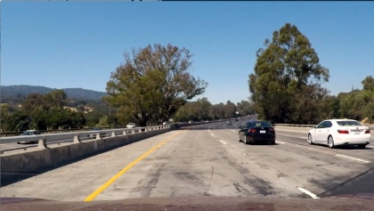
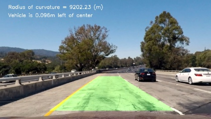

# Advanced Lane Finding for Self-Driving Cars

The goal of this project is to produce a robust pipeline for detecting lane lines given a raw image from a car's dashcam. The pipeline should output a visual display of the lane boundaries, numerical estimation of lane curvature, and vehicle position within the lane.

   

## Files and Usage

1. camera_cal.py
    * Contains code for calibrating the camera to undistort images.
    * `python camera_cal.py` will return the camera matrix and distortion coefficients and save them in a pickle file calibration_pickle.p.
2. thresholds.py
    * Contains code for applying color and gradient thresholds to an image to better detect lane lines.
3. lane_tracker.py
    * Contains code for identifying lane lines and highlighting the lane boundaries.
4. video_generator.py
    * Contains code to generate a video with lane boundaries applied to an input video from a dashcam.
    * `python video_generator.py project_video.mp4` will save the output video as project_video_output.mp4 in the same directory.
5. image_generator.py
    * Contains code to generate images with lane boundaries applied to the test images from a dashcam.
    * `python image_generator.py` will save the output images in the output_images folder.

## Solution

### Overview

The steps taken to complete this project are as follows:

* Compute the camera calibration matrix and distortion coefficients given a set of chessboard images.
* Apply a distortion correction to raw images.
* Use color transforms and gradients to create a thresholded binary image.
* Apply a perspective transform to rectify binary image ("birds-eye view").
* Detect lane pixels and fit to find the lane boundary.
* Determine the curvature of the lane and vehicle position with respect to center.
* Warp the detected lane boundaries back onto the original image.
* Output visual display of the lane boundaries and numerical estimation of lane curvature and vehicle position.

### Camera Calibration

