# Advanced Lane Finding for Self-Driving Cars

The goal of this project is to produce a robust pipeline for detecting lane lines given a raw image from a car's dashcam. The pipeline should output a visual display of the lane boundaries, numerical estimation of lane curvature, and vehicle position within the lane.

   


## Files and Usage

1. camera_cal.py
    * Contains code for calibrating the camera to undistort images.
    * `python camera_cal.py` will return the camera matrix and distortion coefficients and save them in a pickle file calibration_pickle.p.
2. thresholds.py
    * Contains code for applying color and gradient thresholds to an image to better detect lane lines.
3. lane_tracker.py
    * Contains code for identifying lane lines and highlighting the lane boundaries.
4. video_generator.py
    * Contains code to generate a video with lane boundaries applied to an input video from a dashcam.
    * `python video_generator.py project_video.mp4` will save the output video as project_video_output.mp4 in the same directory.
5. image_generator.py
    * Contains code to generate images with lane boundaries applied to the test images from a dashcam.
    * `python image_generator.py` will save the output images in the output_images folder.

## Solution

### Overview

The steps taken to complete this project are as follows:

* Compute the camera calibration matrix and distortion coefficients given a set of chessboard images.
* Apply a distortion correction to raw images.
* Use color transforms and gradients to create a thresholded binary image.
* Apply a perspective transform to rectify binary image ("birds-eye view").
* Detect lane pixels and fit to find the lane boundary.
* Determine the curvature of the lane and vehicle position with respect to center.
* Warp the detected lane boundaries back onto the original image.
* Output visual display of the lane boundaries, numerical estimation of lane curvature, and vehicle position.


### Camera Calibration

Cameras typically do not generate perfect images; some of the objects in the images can get stretched or scewed in various ways, especially near the edges. We can correct for this by performing a camera calibration.
I started by preparing "object points", which will be the (x,y,z) coordinates of the chessboard corners in the world. The provided sample images of chessboards are fixed on the (x,y) plane at z=0, such that the object points are the same for each calibration image. Thus, `objp` is just a replicated array of coordinates, and `objpoints` will be appended with a copy of it every time all of the chessboard corners are successfully detected in a sample image. With each successful chessboard detection, `imgpoints` will be appended with the (x,y) pixel position of each of the corners.
I then used the output `objpoints` and `imgpoints` to compute the camera calibration and distortion coefficients using the OpenCV `calibrateCamera()` function. The resulting camera matrix and distortion coefficients are then used to undistort images using the OpenCV `undistort()` function. Here an original image (left) and an undistorted image (right):

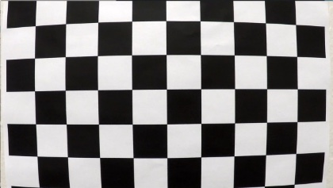      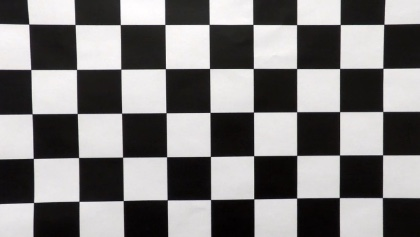

The code for camera calibration is contained in `camera_cal.py` and the sample images and outputs can be found in the camera_cal folder.


### Distortion Correction

Using the camera matrix and distortion coefficients produced in the previous step, I undistort all incoming raw images using the OpenCV `undistort()` function. I use this function in my `apply_lines()` function which can be seen on line 38 of the `lane_tracker.py` file. Notice the difference in position of the white car between the raw image (left) and undistorted image (right):

   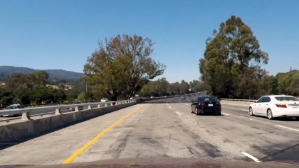


### Thresholded Binary Images

In order to accurately find the lane lines in an image, I applied a number of thresholding techniques to filter out potential noise (such as shadows, different color lanes, other cars, etc). I first applied a color threshold, where I save only the R (red) channel of the RGB image, and combine it with the S (saturation) channel of the image after converting it to HLS space. The reason I keep the red channel is because it does a good job of preserving the lanes in the image, but especially the yellow lane which other filters sometimes fail to detect. The binary image of the R channel (left) and the S channel (right) can be seen below:

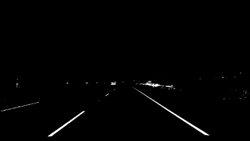  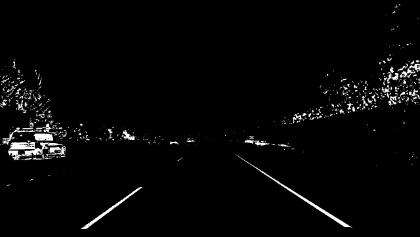

Next, I apply thresholds on the gradients using the OpenCV `Sobel()` function. I apply a threshold on the magnitude of the gradient to filter out weak signals using the `mag_thresh()` function which can be found starting on line 6 of the `thresholds.py` file. I apply a threshold on the direction of the gradient in order to filter out horizonal lines, as the lane lines should be relatively vertical. You can find this `dir_thresh()` function starting on line 30 of the `thresholds.py` file. The binary image using the magnitude threshold (left) and directional threshold (right) can be seen below:

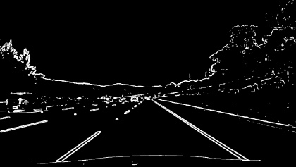  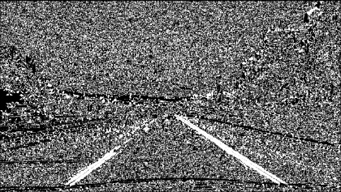

The binary images produced when combining both color thresholds (left) and both gradient thresholds (right):

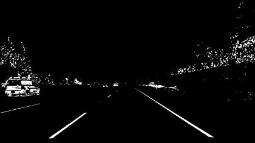  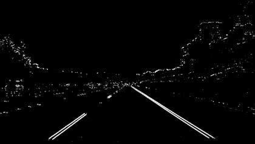

I then combine the color and gradient thresholded binary images to produce the final binary image used in the pipeline for detecting the lane lines. You can see the original undistorted image (left) compared with the thresholded binary image (right) below:

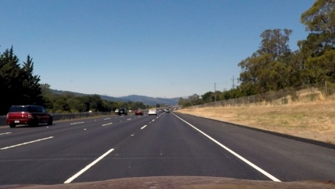  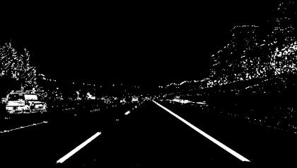

The code for producing the thresholded binary images can be found in `thresholds.py` and some sample output images can be found in the output_images folder.


### Perspective Transform

A perspective transform maps the points in a given image to a different, desired, image points with a new perspective. I use the OpenCV functions getPerspectiveTransform() and warpPerspective() to generate a bird's-eye view of a lane from above, which is useful for calculating the lane curvature. I chose the source points and destination points used to perform the transform following the example given in the course:
```
src = np.float32(
    [[(img_size[0] / 2) - 55, img_size[1] / 2 + 100],
    [((img_size[0] / 6) - 10), img_size[1]],
    [(img_size[0] * 5 / 6) + 60, img_size[1]],
    [(img_size[0] / 2 + 55), img_size[1] / 2 + 100]])
dst = np.float32(
    [[(img_size[0] / 4), 0],
    [(img_size[0] / 4), img_size[1]],
    [(img_size[0] * 3 / 4), img_size[1]],
    [(img_size[0] * 3 / 4), 0]])
```
Using these points resulted in the following undistorted image (left) transformed to a bird's-eye perspective (right):

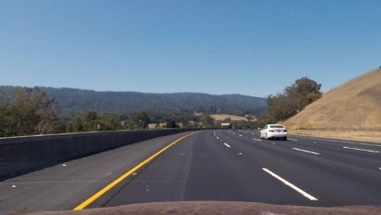  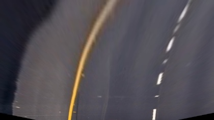

Below is the same applied to the thresholded binary image as described in the previous step:

  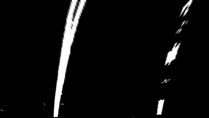

The code for performing the perspective transform can be found on lines 54-70 of the `lane_tracker.py` file.


### Detect Lane Pixels and Fit Lines

To find the pixels of the lane lines I take a histogram of the thresholded binary image by adding up the pixel values along each column in the lower half of the image using `np.sum(img[img.shape[0]/2:,:], axis=0)` as seen on line 85 of the `lane_tracker.py` file. Since pixels are either 0 or 1 in my binary image, the two most prominent peaks in the histogram will be good indicators of the x-position of the base of the lane lines. I then use that as a starting point for where to search for the lane lines, using a sliding window places around the line centers to find and follow the lines up to the top of the frame. A plot of such a histogram can be seen below:

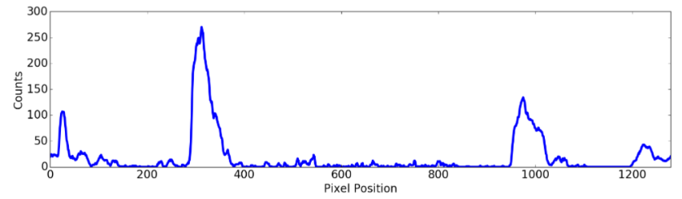

After saving all of the pixel indicies within the windows of interest, I use the numpy `polyfit()` function to fit a second order line to the pixels in the left and right lanes. To increase efficiency, after finding the lane lines I avoid doing an exhaustive search in subsequent frames by instead only searching within a margin around the previous found line positions. A plot of the search windows and the fitted lane lines are shown below:

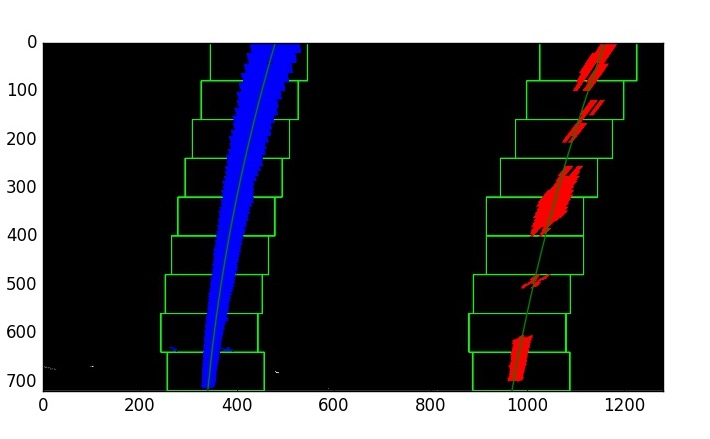

The code to detect the lane pixels and fit the lines can be found on lines 80-146 of the `lane_tracker.py` file.


### Determine Curvature of Lane and Vehicle Position

The radius of curvature of the lane at a particular point is defined as the radius of the approximating circle, which changes as we move along the curve. A good tutorial of the radius of curvature can be found [here](http://www.intmath.com/applications-differentiation/8-radius-curvature.php) which describes the mathematical formula used to calculate it. In addition, I also needed to convert the radius from pixel values to real world space. I used the estimated figures given in the project lectures based on U.S. regulations that require a minimum lane width of 3.6 meters and dashed lane lines of 3 meters long each. 

The code for calculating the radius of curvature can be found on lines 183-193 of the `lane_tracker.py` file.

To calculate the vehicle's position within the lane lines, I first assume that the car's dashcam is mounted at the center of the car. I then find the difference between the center of the image and the center of the two lane lines I've detected to determine the distance from the center of the lane (converted from pixels to meters).

The code for calculating the vehicle position can be found on lines 195-200 of the `lane_tracker.py` file.


### Warp Detected Lane Boundaries onto Original Image

After detecting the lane lines, calculating the radius of curvature, and finding the vehicles position within the lane, I unwarp the image back to the original perspective using the OpenCV `warpPerspective()` function as before, but this time using the inverse matrix. This code can be found on line 174 of the `lane_tracker.py` file.


### Visual Display of the Lane Boundaries, Curvature, and Vehicle Position

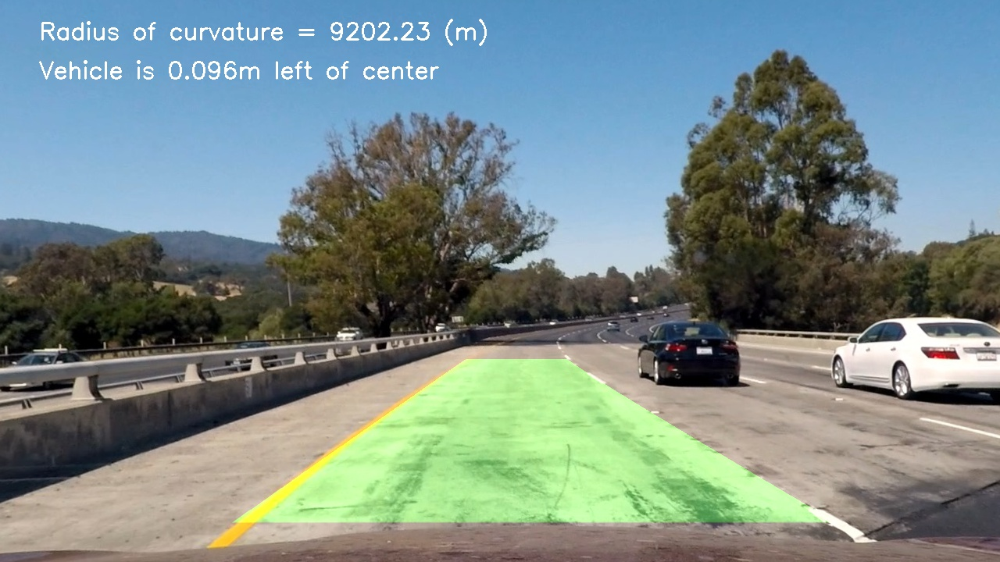

A link to my video result can be found [here](https://youtu.be/irduXA5iaxs)


### Discussion

My pipeline works well on the project video, but I haven't yet extended it to prove effective on the challenge videos. One reason is due to the lane shift seen in the challenge video, along with the different color blacktop in the lane due to construction. A fix for that could be to check the distance between the two detected lane lines. Filtering out lines if they are not the correct distance apart, about 3.7 meters, will filter out other lines like those in the challenge video. Another reason my algorithim currently fails on the harder challenge video is I am currently averaging the lines over 15 frames to smoothin the output of the line boundaries. This produces a nice output for the project video, but fails when faced with consecutive sharp turns. I could reduce the number of frames being averaged over, and maybe use a weighted average instead. I could also experiment with other checks such as determing that the detected left and right lane lines are relatively parallel to be sure the lines are in fact the lane lines. I plan to experiment with these ideas and make my algorithm robust enough to complete the challenge videos in the coming days.
